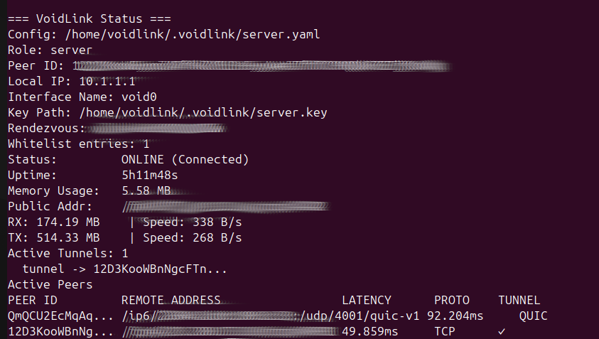
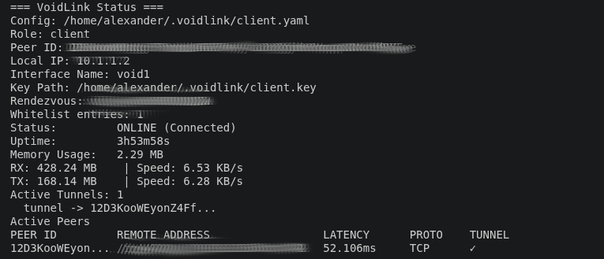

# VoidLink

VoidLink is a Linux CLI tunnel tool that creates a secure point-to-point IP tunnel over libp2p.

## What VoidLink solves

- Provides a secure layer 3 tunnel between a client and a server using `libp2p`.
- Supports discovery using DHT and mDNS or direct connection by explicit server address.
- Allows routing all traffic through the tunnel (`route-all`) or using selective split routing (`route-split`).
- Restricts connections using a whitelist of peer IDs.
- Prevents DNS leaks by configuring DNS resolution locally via `resolvectl`.
- Offers runtime status via a local Unix socket.

## Overview

VoidLink has three main logical parts:

1. CLI commands (`cmd/`)
   - `init`: initialize server or client config
   - `up`: start a tunnel in server or client mode
   - `down`: stop a running tunnel
   - `status`: read runtime status from the running node
   - `peer`: manage whitelist entries
   - `route`: manage split-route configuration

2. Node runtime (`internal/node/`)
   - builds a libp2p host with TCP and QUIC transports
   - starts DHT + bootstrap peers for discovery
   - advertises the server using a rendezvous key
   - establishes a tunnel stream using protocol `/voidlink/1.0`
   - forwards traffic between the local TUN interface and the libp2p stream
   - monitors active tunnels, connection latency, and throughput

3. TUN and routing (`internal/tun/`)
   - creates a Linux TUN device (`void0` for server, `void1` for client)
   - configures interface IP, MTU, and brings it up
   - applies system routes for `route-all` or `route-split`
   - manages DNS for tunnel traffic

### Packet flow

- Local traffic is captured by the TUN interface.
- `internal/engine` frames outbound packets by writing a 2-byte length header plus payload into the libp2p stream.
- Remote peer reads the framed packets, strips the header, and writes payload back into its TUN interface.
- This creates a point-to-point IP tunnel inside the libp2p connection.

## How to use

### Build the binary

```bash
go build -o vlink ./cmd/vlink
```

### Quick start

1. Initialize server and client config:

```bash
./vlink init server --port 12345 --secret my-voidlink
./vlink init client --secret my-voidlink
```

2. Start server:

```bash
sudo ./vlink up server
```

3. Start client using server address (server's whitelist must store client's peerId):

```bash
sudo ./vlink up client --server-address /ip4/1.2.3.4/tcp/12345/p2p/<peer-id>
```

4. Check status:

```bash
sudo ./vlink status client
sudo ./vlink status server
```

5. Stop tunnel:

```bash
sudo ./vlink down client
sudo ./vlink down server
```

### Initialize a server/client

```bash
./vlink init server
./vlink init client
```

You can also specify a listening port for the server or client using `--port`:

```bash
./vlink init server --port 12345
```

If the port is omitted, the process listens on a random available port.

This creates a config directory in `$HOME/.voidlink` by default, together with keys and the rendezvous secret.
It also generates a default split-route list in `default.lst` inside the same config directory, which is used by `route-split` mode.
The config directory is restricted to the owner (`0700`), and private identity keys use `0600` permissions.
Existing installations are migrated to these permissions when the config and key are loaded.

If you want to use a different config directory, add `--config <path>` to every command:

```bash
./vlink init server --config /etc/voidlink
./vlink up client --config /etc/voidlink
```

### Start server

```bash
sudo ./vlink up server
```

If the server will accept direct client connections, make sure the chosen port is open in the server firewall and reachable from the client.
The client itself does not need a public port open for the tunnel if it connects outward to the server.

For traffic forwarding beyond the tunnel endpoint, the server must also have IP forwarding enabled and may need NAT / masquerading configured manually.

### Start client

Option 1: discover server via DHT/mDNS

```bash
sudo ./vlink up client
```

Option 2: connect directly to a server address

```bash
sudo ./vlink up client --server-address /ip4/1.2.3.4/tcp/12345/p2p/<peer-id>
```

### Route options for client

- `--route-all` — route all client traffic through the tunnel.
- `--route-split` — route only configured split routes through the tunnel.

Example:

```bash
sudo ./vlink up client --server-address /ip4/1.2.3.4/tcp/12345/p2p/<peer-id> --route-all
```

```bash
sudo ./vlink up client --server-address /ip4/1.2.3.4/tcp/12345/p2p/<peer-id> --route-split
```

### Stop tunnel

```bash
sudo ./vlink down client
sudo ./vlink down server
```

The `down` command looks for a running `vlink up <role>` process and sends it a terminate signal.
If the process is not found or does not stop cleanly, use forced cleanup.

```bash
sudo ./vlink down client --server-address /ip4/1.2.3.4/tcp/12345/p2p/<peer-id> --force
```

Note: `--force` depends on a known server address because it needs to remove the specific client route entry.

## Peer and route management

### Add or remove a peer from the whitelist

```bash
sudo ./vlink peer add client <peer-id>
sudo ./vlink peer remove client <peer-id>
./vlink peer list client
```

### Add or remove split routes

```bash
sudo ./vlink route add 1.2.3.0/24
sudo ./vlink route remove 1.2.3.0/24
./vlink route list
```

Changes are reloaded by sending SIGHUP to the running process, which the CLI attempts to do automatically when commands change config.
Removing a peer from the whitelist also closes its existing libp2p connection and prevents it from opening new tunnel streams.

## Status and diagnostics

```bash
sudo ./vlink status client
sudo ./vlink status server
```

Status shows:
- tunnel state
- uptime
- memory usage
- current peers and their transport
- RX/TX traffic and speed

### Verify tunnel connectivity

After starting the tunnel, you can verify it works by pinging across the tunnel:

```bash
# From the client, ping the server's tunnel IP
ping -c 4 10.1.1.1

# From the server, ping the client's tunnel IP
ping -c 4 10.1.1.2
```

You should see successful replies if the tunnel is working correctly.

You can also check the system routing table while the tunnel is active:

```bash
ip route show
```

### DNS leak prevention

When using `--route-all` or `--route-split`, DNS queries are protected from leaking outside the tunnel.
VoidLink configures DNS resolution using `resolvectl` to ensure that queries on the tunnel interface are handled locally:

```bash
# DNS is set automatically when the tunnel starts
# You can verify it with:
resolvectl status void1

# Check that DNS queries are actually resolved through the tunnel:
resolvectl query example.com
dig example.com
```

The `-- link: void1` in the output confirms DNS is routed through the tunnel interface.

DNS is automatically restored when the tunnel is stopped with `sudo ./vlink down`.
If route or DNS setup fails partway through startup, VoidLink rolls back the changes that were already applied.

## Notes and limitations

- VoidLink currently supports Linux only.
- The TUN interface names are fixed to `void0` (server) and `void1` (client).
- A node currently supports one active tunnel stream at a time. Additional tunnel streams are rejected until the active tunnel closes.
- `route-split` adds routes directly to the Linux routing table and depends on external split-list sources.
- The tool is designed for small peer-to-peer setups.
- **DHT discovery may be unreliable in some regions.** Public IPFS bootstrap nodes 
  (port 4001/TCP and UDP) are inaccessible or unstable in certain networks, causing 
  the routing table to stay empty and `AsyncFindProviders` to return no results. 
  Use `--server-address` for direct connection as a reliable alternative.

## Useful Makefile commands

```bash
make build
make run-connect-direct-all
make run-connect-direct-split
make stop-connect
make stop-force-connect
```

## Example screenshots
---

---
---

---
